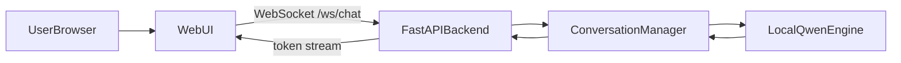

## Dental Clinic Conversational Assistant

This project implements a fully local, CPU-only conversational AI system for a dental clinic appointment assistant. It follows the required architecture:

`Web UI ↔ FastAPI + WebSocket ↔ Conversation Manager ↔ Local LLM Engine`

All intelligence comes from prompt design and conversational state management. No tools, plugins, or RAG are used.

### Architecture Overview

Key components:
- `backend/`: FastAPI app, conversation manager, local LLM client, tests, Dockerfile.
- `frontend/`: React + Vite chat UI with WebSocket integration.
- `docs/`: Use-case description, example dialogues, conversation flow, performance benchmarks.
- `postman/`: Postman collection for REST API testing.

### Model Selection

- The system is designed for a small, CPU-friendly **Qwen2-0.5B-Instruct-GGUF** model.
- By default, `backend/llm/client.py` uses `llama-cpp-python` and `Llama.from_pretrained(repo_id="Qwen/Qwen2-0.5B-Instruct-GGUF", filename="qwen2-0_5b-instruct-fp16.gguf")`, so inference runs locally on CPU after the weights are available.
- Configuration (context window, sampling params) lives in `backend/config.py`.

### Running Locally

1. **Backend**
   - Create and activate a virtual environment.
   - Install dependencies:
     - `pip install -r backend/requirements.txt`
   - Start the FastAPI app:
     - `uvicorn backend.main:app --reload`
   - The API will be available at `http://localhost:8000`.

2. **Frontend**
   - In `frontend/`, install dependencies:
     - `npm install`
   - Start the dev server:
     - `npm run dev`
   - Open the URL shown in the terminal (typically `http://localhost:5173`).

3. **WebSocket URL**
   - The frontend reads `VITE_BACKEND_WS_URL` for the WebSocket endpoint.
   - For local development, it defaults to `ws://localhost:8000/ws/chat`.

### Deployment

- **Backend (Railway)**:
  - Uses `backend/Dockerfile` to run the FastAPI service on CPU.
  - All LLM inference happens inside this container using local model weights.
  - See `backend/deploy_railway.md` for detailed steps.

- **Frontend (Vercel)**:
  - `frontend/vercel.json` configures a static build using Vite (`npm run build`).
  - Set `VITE_BACKEND_WS_URL` in Vercel to point to the Railway WebSocket URL, e.g.:
    - `wss://your-railway-app.up.railway.app/ws/chat`

This satisfies the assignment requirement of local, CPU-only inference (no external cloud LLM APIs) while still allowing cloud deployment of your own containerized backend and static frontend.

### Performance and Evaluation

- **Model benchmarks (end-to-end)**: use `backend/scripts/benchmark_latency.py` (which calls the `/test-dialogue` HTTP endpoint) and record results in `docs/performance_benchmarks.md`.
- **Stress testing**: use `backend/scripts/stress_test_ws.py` to run multiple concurrent WebSocket clients and capture their average latency.
- **Testing**: basic unit tests live in `backend/tests/`.

### Known Limitations

- On some platforms (e.g., Python 3.13 on Kali), building `llama-cpp-python` can be challenging; if the low-level import fails, the HTTP-level benchmarking script still works, but direct model benchmarks may not.
- Conversation state is kept in memory in a single process (sufficient for the assignment, but not horizontally scalable without an external store).

