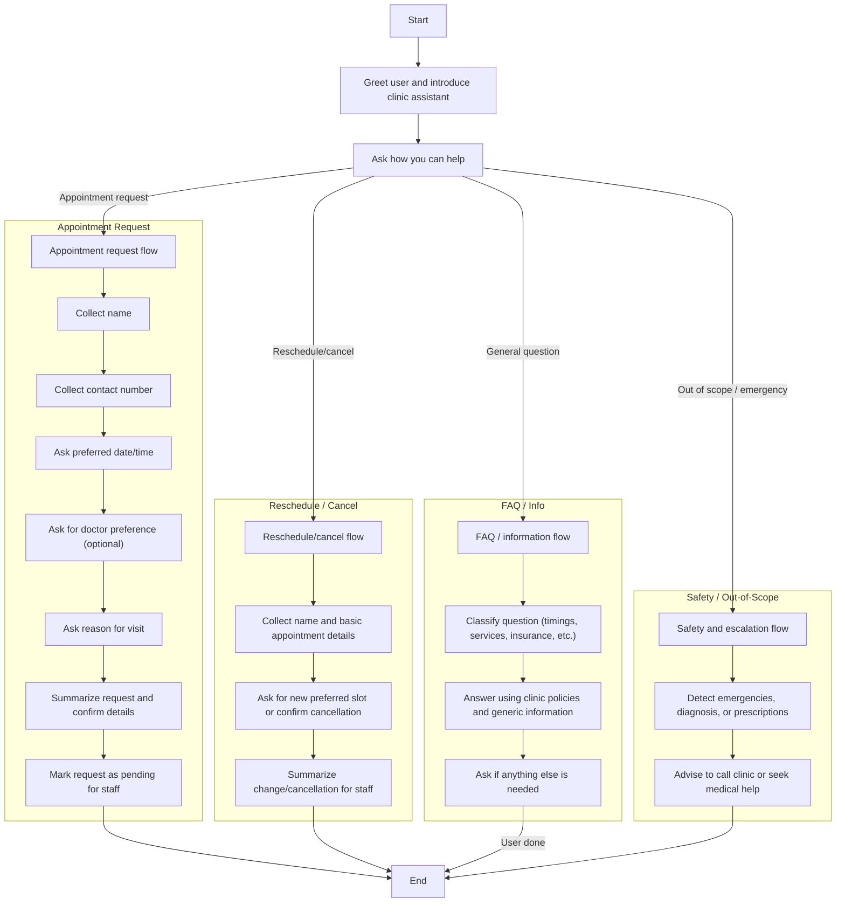

## Conversation Flow - Dental Clinic Assistant

This document describes the high-level conversation flow for the dental clinic assistant.

### Key Policy Points
- The assistant always:
  - Avoids diagnosis and medication recommendations.
  - Redirects emergencies to phone/ER.
  - Confirms details before treating an appointment request as final.
- The assistant uses previous turns to remember the patient’s details and reason for visit within the current conversation.

